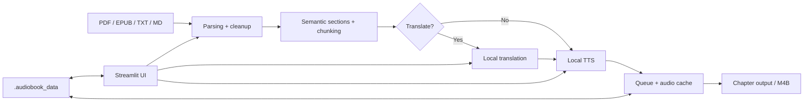

# Local Audiobook Studio

A privacy-first Windows application for turning locally owned PDF, EPUB, TXT, and Markdown books into structured audiobooks with optional local translation and local neural TTS.


## What it does

- Imports **PDF, EPUB, TXT, and Markdown** books.
- Cleans extracted text and detects semantic sections/chapters.
- Supports **Exact, Natural, and Study** reading workflows.
- Persists projects locally with queue/resume support and reusable audio caches.
- Provides pronunciation rules, replacements, skip rules, narration overrides, and issue tracking.
- Optionally translates text locally before narration.
- Generates chapter-aware audiobook output, including **M4B**.
- Keeps normal runtime local: sidecars bind to loopback addresses and telemetry is disabled.

## TTS stack

| Engine | Role | Notes |
| --- | --- | --- |
| **Chatterbox Multilingual V3** | Primary German/multilingual narration | Recommended; Fast Quality uses the validated FP32 T3 CUDA Graph path when supported |
| **Kokoro** | Lightweight English narration | Runs locally through ONNX |
| **Qwen3-TTS** | Optional multilingual fallback | Kept as an advanced fallback |

Chatterbox and Qwen run as local sidecars. Kokoro runs in the main application process.

## Quick start

### 1. Clone the repository

```powershell
git clone https://github.com/Morsells/local-audiobook-studio.git
cd local-audiobook-studio
```

### 2. Install the base application

Python **3.12** is recommended on Windows.

```powershell
.\Setup-Audiobook-Studio.bat
```

This creates `.venv`, installs the base dependencies, and downloads the local Kokoro model files into `models/`.

### 3. Install Chatterbox for the recommended narration path

```powershell
.\Setup-Chatterbox-GPU.bat
```

This creates the isolated `.venv-chatterbox` environment, installs the pinned Chatterbox V3 source, installs its CUDA-enabled PyTorch runtime, and downloads the required model assets.

### 4. Start the studio

Recommended:

```powershell
.\Start-Audiobook-Studio-With-Chatterbox.bat
```

Then open:

```text
http://127.0.0.1:8501
```

The automatic launcher is also available:

```powershell
.\Start-Audiobook-Studio.bat
```

## Optional local translation

The application supports local translation workflows, including Ollama-hosted models and local OPUS-MT models.

For the literary Ollama workflow:

```powershell
.\Setup-Literary-Translation.bat
.\Start-Audiobook-Studio-Translate.bat
```

The default helper uses `translategemma:12b`. Translation-only mode leaves heavy TTS sidecars unloaded so GPU memory can be dedicated to translation.

## Typical workflow

1. Upload/open a book.
2. Select the page range or content to process.
3. Analyze the source and inspect the detected chapter hierarchy.
4. Edit narration text, pronunciation rules, replacements, or skip rules if needed.
5. Optionally translate selected sections locally.
6. Choose a narration engine and generate a preview.
7. Queue the selected chapters/sections.
8. Resume interrupted work from the persistent local project state.
9. Export the final audiobook with chapter navigation.

## Architecture



More detail: [docs/ARCHITECTURE.md](docs/ARCHITECTURE.md)

## Privacy model

Normal audiobook processing is designed to stay on the machine:

- Streamlit binds to `127.0.0.1`.
- Chatterbox binds to `127.0.0.1:7869`.
- Qwen3-TTS binds to `127.0.0.1:7867`.
- The runtime applies an outbound socket guard for non-loopback TCP connections.
- Model/package downloads are explicit setup operations, not part of normal book processing.
- Project data, translations, generated chunks, and voice references stay under `.audiobook_data/`.

This is an application-level privacy design, not an OS sandbox.

## Project data

Do **not** delete `.audiobook_data/` when updating the application. It contains persistent project state such as imported source copies, analysis metadata, translation state, queue state, generated audio, final output, and project-local voice references.

The directory is intentionally excluded from Git.

## Repository structure

```text
app.py                         Streamlit UI
src/audiobook_studio/          Core parsing, cleanup, translation and pipeline code
scripts/                       Setup helpers, sidecars, worker and runtime scripts
tests/                         Automated regression tests
.streamlit/                    Streamlit configuration
requirements*.txt              Runtime-specific dependency groups
*.bat                          Windows setup/start/stop helpers
docs/                          Architecture and project documentation
```

Large model files, virtual environments, generated books/audio, logs, and user project data are intentionally not tracked.

## Development

Install the base environment, activate it, then run:

```powershell
.\.venv\Scripts\Activate.ps1
python -m pytest -q
```

## Current scope

- Windows is the primary supported platform.
- Chatterbox GPU setup currently targets NVIDIA CUDA on Windows.
- Qwen3-TTS is retained as an optional advanced fallback rather than the default path.
- OCR remains optional and depends on local OCR tooling configured by the user.
- Performance depends strongly on GPU, source text, and selected TTS engine.

## Third-party components

Model weights are not committed to this repository. See [THIRD_PARTY_NOTICES.md](THIRD_PARTY_NOTICES.md) for the main upstream projects and redistribution notes.
