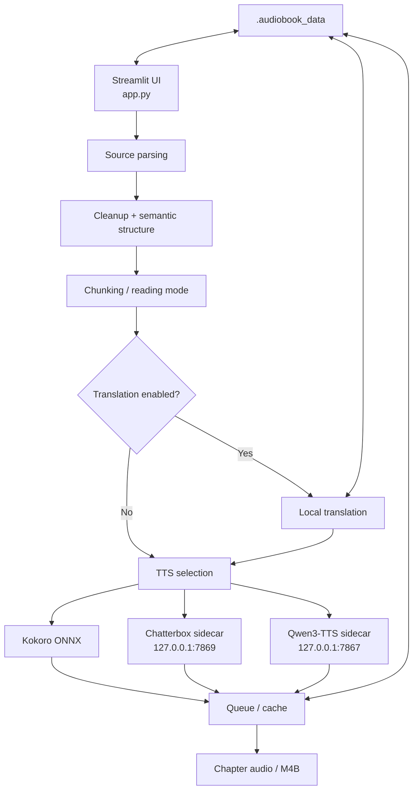

# Architecture

Local Audiobook Studio is organized around a Streamlit front end, a reusable Python core, isolated local TTS sidecars, and persistent per-book project directories.

## High-level flow



## Main components

| Area | Main files | Responsibility |
| --- | --- | --- |
| UI | `app.py` | Project selection, analysis, translation, narration settings, previews, queue and export controls |
| Configuration | `src/audiobook_studio/config.py`, `models.py` | Paths, defaults, enums and build options |
| Ingestion | `source_parser.py`, `pdf_parser.py` | PDF/EPUB/TXT/Markdown loading and extraction |
| Structure | `semantic.py`, `humanizer.py`, `chunker.py` | Section detection, narration cleanup and chunk construction |
| Translation | `translation.py`, `local_ai.py` | Local translation engines, Ollama integration, validation and persistence |
| Audio | `audio.py`, `preview.py` | TTS selection, preview generation, audio assembly and export |
| Persistence | `project.py`, `storage.py` | Atomic project state, cache/output directories, settings and metadata |
| Queue | `queue_manager.py`, `scripts/queue_worker.py` | Persistent jobs, pause/resume and background generation |
| Privacy | `privacy.py` | Runtime network restrictions and local-only environment controls |
| TTS sidecars | `scripts/chatterbox_tts_server.py`, `scripts/qwen_tts_server.py` | Isolated local GPU model servers |
| Fast Chatterbox path | `scripts/chatterbox_fast_backend.py` | Retained FP32 CUDA Graph optimization used by Fast Quality |

## Persistent project layout

Each imported book gets a hashed project directory under `.audiobook_data/`. The project store keeps source material and generated state together so work can be resumed without rebuilding everything.

Typical contents include:

```text
.audiobook_data/
└── <book>-<hash>/
    ├── project.json
    ├── settings.json
    ├── analysis.json
    ├── pronunciation.json
    ├── replacement_rules.json
    ├── skip_strings.json
    ├── narration_overrides.json
    ├── translation_settings.json
    ├── translation_glossary.json
    ├── translation_memory.json
    ├── translations.json
    ├── queue.json
    ├── queue_control.json
    ├── worker_status.json
    ├── audio_chunks/
    ├── previews/
    └── output/
```

Writes to small JSON state files use atomic replacement with Windows-friendly retry behavior.

## TTS isolation

The heavier neural TTS engines use separate Python environments:

- `.venv-chatterbox` for Chatterbox Multilingual V3
- `.venv-qwen` for optional Qwen3-TTS
- `.venv` for the Streamlit application, Kokoro ONNX, parsing and general workflow

This keeps dependency conflicts and GPU-specific packages out of the main application environment.

## Privacy boundary

The application is designed for local processing:

- web UI and TTS sidecars bind to loopback only
- telemetry is disabled by launch configuration
- normal runtime enables offline-oriented environment settings
- an application-level socket guard blocks non-loopback outbound TCP traffic during protected runtime paths

Setup scripts intentionally use the internet to install Python packages and download model files. The privacy guard is not a replacement for an operating-system sandbox or firewall.

## Chatterbox Fast Quality

The retained Fast Quality path keeps the Chatterbox model, voice reference, sampling parameters, and FP32 precision while accelerating the T3 decode path with a CUDA Graph when the GPU/runtime supports it. The application can fall back to the official inference path when the fast backend is unavailable.
